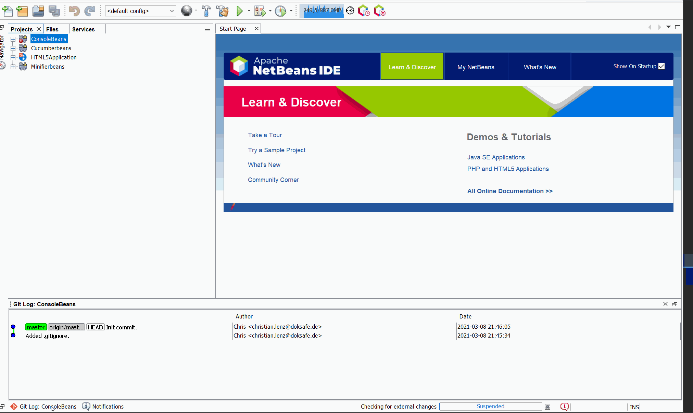

# gitlogbeans

## Description
Show git commit logs in NetBeans

## Apache NetBeans and JDK Compatibility

JDK >=

Apache NetBeans >= 9.0
  
Plugin is available at https://github.com/Chris2011/gitlogbeans/releases/tag/0.0.1-SNAPSHOT